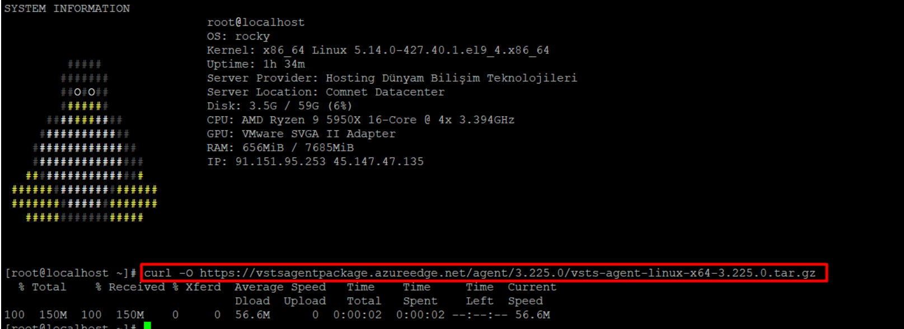
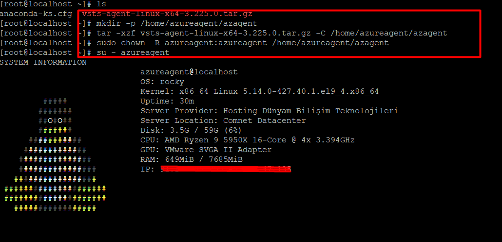
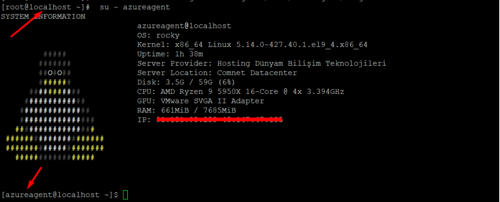
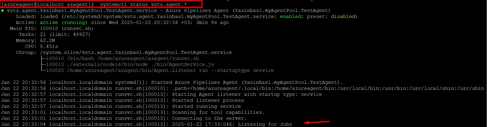
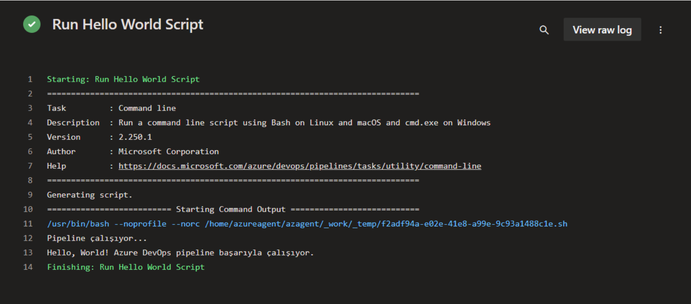
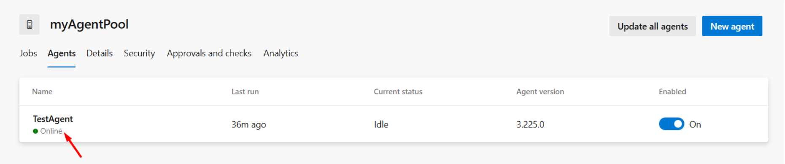

# Azure DevOps Agent Kurulum Rehberi (Rocky Linux)

Bu rehber, Rocky Linux üzerinde Azure DevOps Agent kurulumunu ve temel yapılandırmasını adım adım açıklamaktadır.

---

## Ön Koşullar

1. **Sistemin Güncellenmesi**
   ```bash
   sudo dnf update -y
   ```
   Sistem paketlerinin en güncel versiyonlarını yükleyerek potansiyel uyumsuzlukları önler.

2. **Yeni Kullanıcı Oluşturma**
   ```bash
   sudo useradd -m azureagent
   sudo passwd azureagent
   ```
   Azure DevOps Agent için ayrı bir kullanıcı oluşturun.

3. **Kullanıcıya Yetki Verme**
   ```bash
   sudo usermod -aG wheel azureagent
   ```
   Yeni oluşturulan kullanıcıya yönetici yetkileri sağlayın.

---

## Azure DevOps Agent Kurulum Adımları

1. **Agent Paketini İndirme**
   ```bash
   curl -O https://vstsagentpackage.azureedge.net/agent/3.225.0/vsts-agent-linux-x64-3.225.0.tar.gz
   ```
   

2. **Agent Dosyasını Çıkarma**
   ```bash
   mkdir -p /home/azureagent/azagent
   tar -xzf vsts-agent-linux-x64-3.225.0.tar.gz -C /home/azureagent/azagent
   ```
   

3. **Dosya İzinlerini Ayarlama**
   ```bash
   sudo chown -R azureagent:azureagent /home/azureagent/azagent
   ```

4. **Agent Yapılandırması**
   ```bash
   su - azureagent
   cd /home/azureagent/azagent
   ./config.sh
   ```
   

5. **Agent Hizmetini Başlatma**
   ```bash
   sudo ./svc.sh install
   sudo ./svc.sh start
   ```
   Agent'ı bir hizmet olarak sistemde başlatın. 



---

## Azure DevOps Pipeline Testi

1. **Pipeline Dosyası (.yaml) Oluşturma**

   Azure DevOps portalında yeni bir pipeline oluşturun ve aşağıdaki örnek `azure-pipelines.yaml` dosyasını kullanın:

   ```yaml
   trigger:
     - main

   pool:
     name: myAgentPool

   steps:
     - script: |
         echo "Pipeline çalışıyor..."
         ./hello_world.sh
       displayName: 'Run Hello World Script'
   ```

2. **Test Scripti Ekleyin**

   `hello_world.sh` dosyasını oluşturun ve aşağıdaki içeriği ekleyin:

   ```bash
   #!/bin/bash
   echo "Hello, World! Azure DevOps pipeline başarıyla çalışıyor."
   ```

   Script'i çalıştırılabilir hale getirin:
   ```bash
   chmod +x hello_world.sh
   ```

3. **Pipeline'ı Çalıştırın**

   Azure DevOps portalında pipeline'ı başlatın ve aşağıdaki çıktıyı doğrulayın:
   ```
   Pipeline çalışıyor...
   Hello, World! Azure DevOps pipeline başarıyla çalışıyor.
   ```

   

---

## Doğrulama ve Kontrol

- **Agent Durumunu Kontrol Etme**
  ```bash
  systemctl status vsts.agent.*
  ```
  Agent hizmetinin çalışır durumda olduğunu doğrulayın.

- **Azure DevOps Portalında Agent'ı Görüntüleme**
  Azure DevOps portalına giderek agent'ın bağlı ve kullanılabilir durumda olduğunu kontrol edin.
  

---

## Sonuç

Bu adımları takip ederek Rocky Linux üzerinde Azure DevOps Agent kurulumunu tamamladınız ve temel pipeline testini başarıyla gerçekleştirdiniz. İlerleyen süreçte pipeline'ınızı özelleştirerek projelerinize entegre edebilirsiniz. Herhangi bir sorunla karşılaşırsanız, lütfen destek ekibinizle iletişime geçin.
